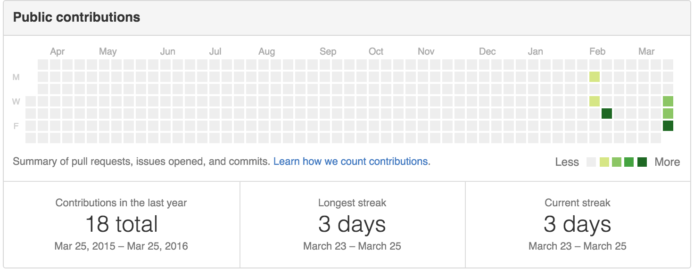
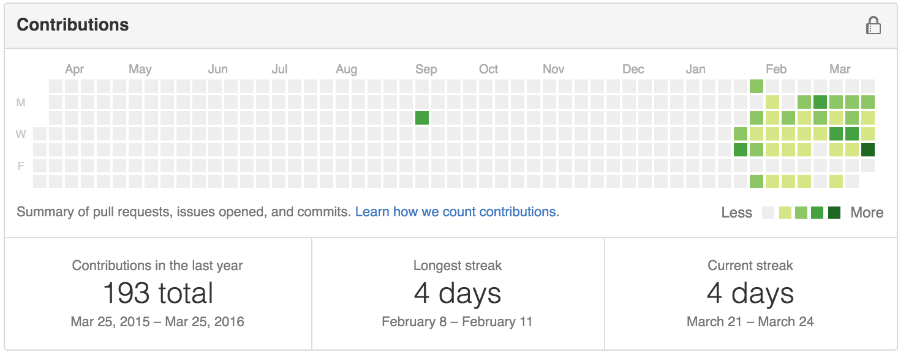
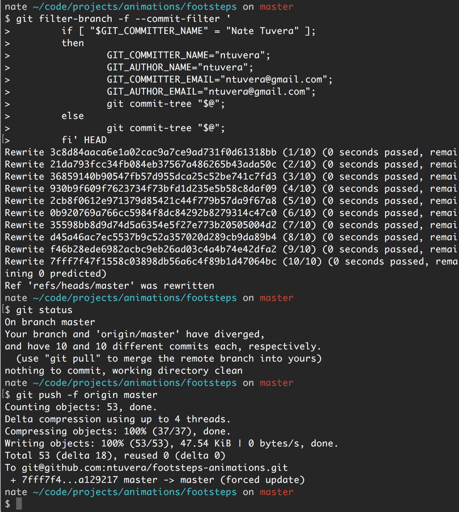
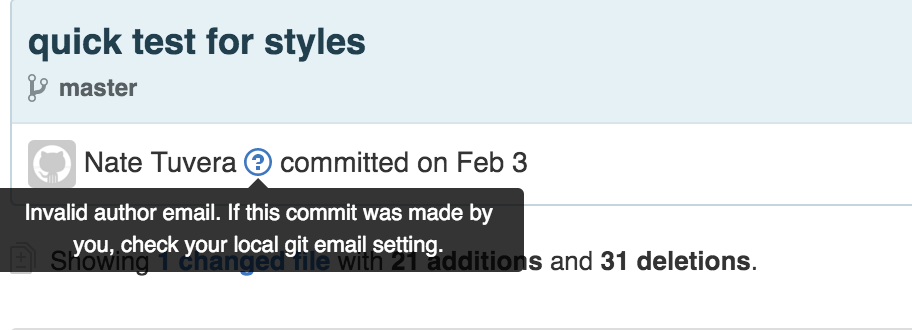

#Haaalp!!! Where are all my Commits?
A guide to getting back on track with Git commits<br>
We've been coding since the beginning of February and we should have a commit ideally everyday, but I'll settle for every other day.  Unfortunately, this is a repository where there are commits, but the commits are not being connected to the user's Github profile. **WTFBBQ?!**
___
<BR>
###Snyopsis:

From this


To


By going fixing your gitglobalconfig and going through your old repos and changing the commit author name & email for all commits.
___

<br>


We've been coding since the beginning of February and we should have a commit ideally everyday, but I'll settle for every other day.  Unfortunately, this is a repository where there are commits, but the commits are not being connected to the user's Github profile. **WTFBBQ?!**
<br>

By now over the course of your time sitting behind your laptop while coding, you've gotten used to endlessly typing 

```
$ git add . 
$ git commit -m 'insert meaningful message here'
$ git push origin master
```
(Oh, you haven't? **A**lways **B**e **C**ommiting)  

We've told Github, "Hey, I've done all this work, give me credit for it so I can show it off in my profile or have my commits link back to me".  

### Git globalconfig && variable names

(http://github.com/urltoimportantcode)

It's come to my attention that over the course of coding, somehow my ```.gitconfig``` settings we're changed without my knowledge.  I have no narrowed down the cause of this, but I can clearly see the effects of this change.  


#### Fixing Author Name/email for future commits

Going forward let's fix your future commits.  Each commit message references a "name" and email.  I use my Github username as my name and you **must** use the email you signed up with Github.

```
/Users/nate/.gitconfig...

[user]
	name = ntuvera (should match your github username)
	email = ntuvera@gmail.com (shoudl match your email you signed up with)
```

shortcut commands to change your "name" and email:

```git config --global user.name "ntuvera"```

```git config --global user.email ntuvera@gmail.com```


#### Fixing old Commits

Per a Repo You'll need to collect Offending Emails and User Names

```
git filter-branch -f --commit-filter '
        if [ "$GIT_COMMITTER_NAME" = "Nate Tuvera" ];
        then
                GIT_COMMITTER_NAME="ntuvera";
                GIT_AUTHOR_NAME="ntuvera";
                GIT_COMMITTER_EMAIL="ntuvera@gmail.com";
                GIT_AUTHOR_EMAIL="ntuvera@gmail.com";
                git commit-tree "$@";
        else
                git commit-tree "$@";
        fi' HEAD
```

The above command (yes that's one command), will search through all the commits in your ```/.git``` folder and search for ```$GIT_COMITTER_NAME``` and it should be set to the offending name.  After the `then` you will be reassigning the ```Commiter_name```, ```author_name```, ```commuter_email```, `commuter_name`





Within the if statement, you'll need to find keep track of what is wrong with your current commits on Github.



You can see that this doesn't look right, but I can see the GIT_AUTHOR_NAME is my full name, when it should be my Github username.  Either way, this is the filter point we're going to use.
The first ```GIT_COMMITTER_NAME``` will equal my full name, or whatever is the incorrect name.  This situation can also be aimed using an email, but I can quickly and easily see my Username is not as expected, so we'll procede from there.

```GIT_COMIITER_NAME``` & ```GIT_AUTHOR_NAME``` should equal your Github User name.

```GIT_COMMITER_EMAIL``` & ```GIT_AUTHOR_EMAIL``` should equal the email you signed with Github.
<BR>
<BR>
<BR>

***

--- in progress ---

